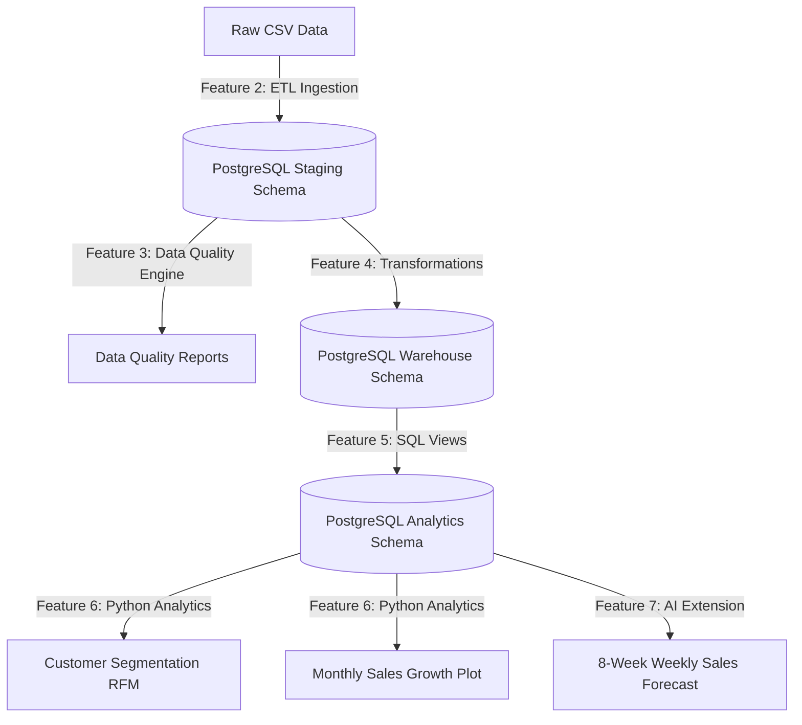

# Enterprise Retail Decision Intelligence Platform

## Overview
An enterprise-scale analytics platform designed to consolidate retail e-commerce transactions, audit data quality, manage a robust star schema data warehouse, serve business KPIs through analytics views, and forecast sales trends using machine learning.

The pipeline is engineered around the **Olist Brazilian E-Commerce dataset**.

---

## Tech Stack
*   **Database:** PostgreSQL (with `psycopg2` connection pools)
*   **Data Processing:** Pandas, NumPy, SQLAlchemy
*   **Data Quality Engine:** Custom SQL-driven metric aggregators
*   **Python Analytics & ML:** Scikit-Learn (Random Forest regressor)
*   **Visualizations:** Matplotlib, Seaborn

---

## Architecture & Features



### Feature Breakdown & Code Location

1.  **Feature 1: Database Setup & DDL**
    *   Creates staging, warehouse, and analytics schemas.
    *   Defines raw staging tables, dimension tables (`dim_customers`, `dim_sellers`, `dim_products`, `dim_date`), fact tables (`fact_orders`, `fact_order_items`, `fact_payments`, `fact_reviews`), and indexes.
    *   *Code:* [01_Create_Database.sql](file:///c:/Users/hymad/Enterprise-Retail-Decision-Intelligence/03_Database/SQL/01_Create_Database.sql), [03_Create_Tables.sql](file:///c:/Users/hymad/Enterprise-Retail-Decision-Intelligence/03_Database/SQL/03_Create_Tables.sql), [04_Create_Indexes.sql](file:///c:/Users/hymad/Enterprise-Retail-Decision-Intelligence/03_Database/SQL/04_Create_Indexes.sql)
2.  **Feature 2: Automated ETL to Staging**
    *   Sequentially ingests 9 raw CSV files, trims whitespaces, cleans text columns, formats datetimes, and re-loads them into the staging schema using SQLAlchemy bulk inserts.
    *   *Code:* [csv_loader.py](file:///c:/Users/hymad/Enterprise-Retail-Decision-Intelligence/04_ETL/loaders/csv_loader.py), [load_csv_to_postgres.py](file:///c:/Users/hymad/Enterprise-Retail-Decision-Intelligence/04_ETL/loaders/load_csv_to_postgres.py)
3.  **Feature 3: Data Quality Engine**
    *   Audits loaded staging tables for missing values, primary/composite key duplicates, and range/logical constraints.
    *   Generates a Markdown report and CSV summary logs.
    *   *Code:* [check_missing.py](file:///c:/Users/hymad/Enterprise-Retail-Decision-Intelligence/04_ETL/quality/check_missing.py), [check_duplicates.py](file:///c:/Users/hymad/Enterprise-Retail-Decision-Intelligence/04_ETL/quality/check_duplicates.py), [check_datatypes.py](file:///c:/Users/hymad/Enterprise-Retail-Decision-Intelligence/04_ETL/quality/check_datatypes.py), [generate_quality_report.py](file:///c:/Users/hymad/Enterprise-Retail-Decision-Intelligence/04_ETL/quality/generate_quality_report.py)
4.  **Feature 4: Warehouse Ingestion & Transformations**
    *   Runs transaction-safe SQL transformation statements to load dimensional and fact tables.
    *   Generates date dimension series, maps English category translations, and pre-computes order delivery delay metrics.
    *   *Code:* [load_warehouse.py](file:///c:/Users/hymad/Enterprise-Retail-Decision-Intelligence/04_ETL/warehouse/load_warehouse.py)
5.  **Feature 5: Analytics Views & KPIs**
    *   Creates SQL views in the `analytics` schema mapping all 10 business KPIs (Revenue, Orders, AOV, Repeat Purchase Rate, Delivery Delay, Ratings, Categories, Geography, Payments, and RFM bases).
    *   *Code:* [05_Create_Views.sql](file:///c:/Users/hymad/Enterprise-Retail-Decision-Intelligence/03_Database/SQL/05_Create_Views.sql)
6.  **Feature 6: Python Analytics & Insights**
    *   Performs Recency, Frequency, and Monetary (RFM) customer clustering and exports segment distributions.
    *   Calculates Month-over-Month (MoM) revenue growth trends and 3-month rolling averages.
    *   *Code:* [rfm_segmentation.py](file:///c:/Users/hymad/Enterprise-Retail-Decision-Intelligence/05_Python_Analytics/Segmentation/rfm_segmentation.py), [sales_trend_analysis.py](file:///c:/Users/hymad/Enterprise-Retail-Decision-Intelligence/05_Python_Analytics/Statistics/sales_trend_analysis.py)
7.  **Feature 7: AI Extension & Demand Forecasting**
    *   Aggregates sales by week, constructs lag features, trains a Random Forest regressor, and recursively predicts sales for the next 8 weeks.
    *   *Code:* [demand_forecast.py](file:///c:/Users/hymad/Enterprise-Retail-Decision-Intelligence/05_Python_Analytics/Forecasting/demand_forecast.py)

---

## End-to-End Ingestion & Execution Flow

To run the entire platform pipeline and generate reports:

### 1. Database DDL Initialization
Run these SQL scripts in PostgreSQL (against the `enterprise_retail_dw` database) in order:
```bash
# 1. Schemas
psql -U postgres -d enterprise_retail_dw -f 03_Database/SQL/02_Create_Schemas.sql
# 2. Tables
psql -U postgres -d enterprise_retail_dw -f 03_Database/SQL/03_Create_Tables.sql
# 3. Indexes
psql -U postgres -d enterprise_retail_dw -f 03_Database/SQL/04_Create_Indexes.sql
```

### 2. Ingest CSVs to Staging Schema
```bash
python -m 04_ETL.loaders.load_csv_to_postgres
```

### 3. Generate Data Quality Report
```bash
python -m 04_ETL.quality.generate_quality_report
# View report under: 10_Reports/Data_Quality/data_quality_report.md
```

### 4. Transform and Load to Data Warehouse
```bash
python -m 04_ETL.warehouse.load_warehouse
```

### 5. Create Analytics Views
```bash
psql -U postgres -d enterprise_retail_dw -f 03_Database/SQL/05_Create_Views.sql
```

### 6. Run Python RFM Segmentation & Trend Plotting
```bash
python -m 05_Python_Analytics.Segmentation.rfm_segmentation
python -m 05_Python_Analytics.Statistics.sales_trend_analysis
# View charts under: 10_Reports/Dashboard/
```

### 7. Run AI weekly Sales Demand Forecast
```bash
python -m 05_Python_Analytics.Forecasting.demand_forecast
# View forecasting line plot under: 10_Reports/Dashboard/demand_forecast.png
```